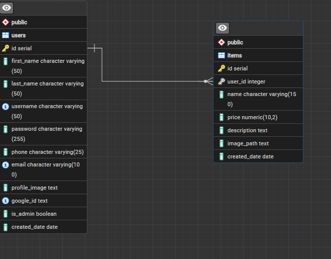

Project description
The project is a marketplace designed for people who would like to buy and sell tech products. The site connects interested users with sellers to inquire about the product and to coordinate the sell of the product outside of the site. The website is meant to be used by everybody, therefore there is no login required for people looking to buy or to learn about it. 

Database Schema. 

User Roles
There are only 2 users in the project:
-	Sellers: these users are allowed to manage and create listing for their products to sell. They would be able to update existing listings. 
-	Admins: this type of user has user control and would be able to delete listings and the users that created them. 

The two users are:
- byusellers
- byuadmin

Known limitations:
-	You the create listing does not redirect, you will have to go back. 
-	The sign in with Google does not work. 
-	There is only 2 types of users. 

